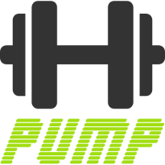

**Estou começando o projeto, então, não há nada funcional por enquanto!**

PumpApp é um aplicativo para ser usado durante um treino de musculação. Com ele é possível cadastrar os exercícios, séries, carga, etc. de sua ficha e executar o treino. O App vai percorrer, junto com o usuário, cada exercício a ser feito, marcando o tempo de descanso e facilitando a conclusão da ficha. Ao final deve gravar um log com o tempo gasto em cada exercício, evolução do aumento de carga, etc.


## Tecnologias

O aplicativo funciona off-line. A princípio não deve sincronizar dados com backend e pretendo utilizar um framework mobile cross-platform não só para estudos como para alcançar mais dispositvos.

- [Ionic Framework](https://github.com/driftyco/ionic)
- [PouchDB](https://github.com/pouchdb/pouchdb)


## TODO

- Comandos por voz para treinar. O usuário pode iniciar, pausar, terminar um exercício através de comando como "start", "stop", etc.
	- [Annyang resolve esse problema](https://github.com/TalAter/annyang)
- Gráficos com a evolução do usuário. Alguma biblioteca gráfica e definir uma modelagem para armazenar qualquer alteração na ficha.
- Fazer o aplicativo interagir mais com o usuário, p.ex., contando as séries, mensagens de estímulo. Encontrar uma lib js de text-to-speech.
- Fazer backup da ficha na nuvem.
- Interação com outros usuários do aplicativo, como mensagens, likes, etc.
- i18n no código e documentação


## Modelo de Dados

```
var treino = {
  motivo: "Treino inicial para ambientação. Duração de 1 mês.",
  dataInicio: 20150101,
  dataFinal: 20150201,
  
  aluno: {
    nome "Jonathas Amaral",
    nascimento: 20150101
    sexo: "m",
    medidas: {
      altura: 1,
      peso: 2,
      ombro: 3,
      peito: 4,
      braco: 5,
      cintura: 6,
      quadril: 7,
      coxa: 8,
      panturrilha: 9
    }
  },
  
  fichas: [
    {
      id: "Ficha #1",
      descricao: "Desenvolver biceps e costas",
      frequencia: [1,3,5],
      icone: "ion-plus",
      exercicios: [
        {
          nome: "Remada Baixa",
          serie: 4,
          carga: [10,12,14,16],
          repeticao: [10,8,6,4],
          descanso: 60,
          observacao: "Flexionar os joelhos ao realizar o exercicio."
        },
        {
          nome: "Rosca Direta",
          serie: 3,
          carga: [14],
          repeticao: [8],
          descanso: 60,
          observacao: ""
        }]
    }]
}
```


## Objetos Individuais

#### Domínio: Treino

```
treino: {
  motivo: "",
  dataInicial: 0,
  dataFinal: 0,
  aluno: {},
  fichas: []
}
```

#### Domínio: Aluno

```
aluno: {
  nome "",
  nascimento: 0
  sexo: "",
  medidas: {}
}
```

#### Domínio: Medidas

```
medidas: {
  altura: 0,
  peso: 0,
  ombro: 0,
  peito: 0,
  braco: 0,
  cintura: 0,
  quadril: 0,
  coxa: 0,
  panturrilha: 0
}
```

#### Domínio: Ficha

```
ficha: {
  id: "",
  descricao: "",
  frequencia: [],
  icone: "",
  exercicios: []
}
```

#### Domínio: Exercício

```
exercicio: {
  nome: "",
  serie: 0,
  carga: [],
  repeticao: [],
  descanso: 0,
  observacao: ""
}
```


